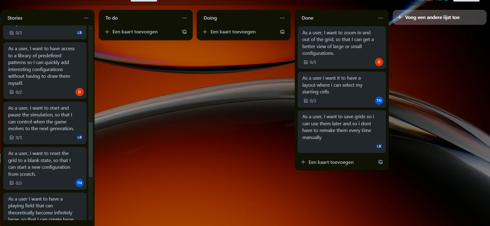
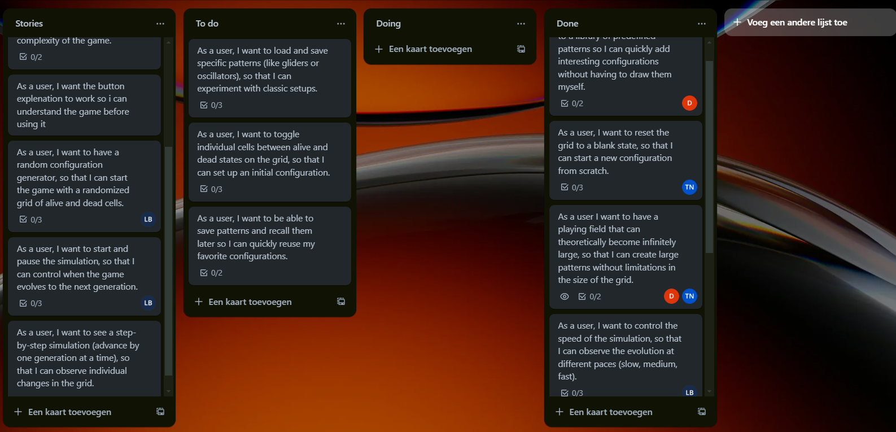

Opdracht 1: Plant werkzaamheden en bewaakt de voortgang
Criterium 1.3: Planning maken

Sprint 1

Tijdens onze eerste sprint hebben wij de user story 1, 2 en 3 afgemaakt.

Sprint 2

Tijdens onze eerste sprint hebben wij de user story 4, 5, 6, 7 en 8 afgemaakt.

